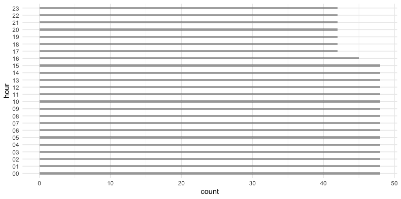

# Graphical soundscapes analysis

This repository provides a simple step by step procedure to analyze raw audio recordings coming from passive acoustic sensors using the approach proposed by Campos-Cerqueira et al., 2017, Forumo et al., 2019, and Campos-Cerqueira et al., 2017.

## Dependencies

To run the scripts you will need the following R packages:

- seewave
- tuneR 
- vegan: Community Ecology Package
- ggplot
- viridis

Install the packages and load the libraries

```R
install.packages(c("seewave", "tuneR", "vegan", "ggplot2", "viridis"))
```

## 1. Load packages and functions


```R
library(viridis)
library(tuneR)
library(seewave)
library(vegan)
library(ggplot2)
source('graph_soundscape_fcns.R')
```

## 2. Get audio metadata

Set the location of the audio recordings. For this simple example, the audio directory should have all the files of a single recording plot.

```R
path_files = '~/audio_example/'  # Folder location of acoustic dataset
```

Get a file list of all .wav samples

```R
flist = list.files(path_files, recursive = T, pattern = '.WAV', ignore.case = T)
```

Get metadata from raw recordings. Songmeter and Audiomoth are the currently supported audio recorders.

```R
df = metadata_audio(flist, path_files, verbose = T, rec_model = 'SM')
```

Plot metadata to evaluate if there were any recording issues

```R
plot_sampling(df, y_axis_factor = df$sm_model, color_factor = df$sm_model, 
              shape_factor = factor(df$sample.rate), plot_title = df$sensor_name[1])

ggplot(df, aes(y=hour)) + geom_bar(width=0.3, alpha=0.5)  # samples per hour

ggplot(df, aes(y=day)) + geom_bar(width=0.3, alpha=0.5). # samples per day

```




## 3. Compute and plot graphical soundscapes

```R
gs = graphical_soundscape(df, spec_wl=256, fpeaks_th=0.003, fpeaks_f=0, verbose=T)
plot_graphical_soundscape(gs)
```

Example of a 24 hour graphical soundscape computed from 1108 audio recordings collected in a tropical dry forest patch in Dagua, Valle del Cauca, Colombia.


## Batch process


Further scripts are provided to batch analyze data from multiple recording plots:

- read_audio_metadata.R
- batch_compute_graph_soundscape.R

## References

- Campos‐Cerqueira, M., et al., 2020. How does FSC forest certification affect the acoustically active fauna in Madre de Dios, Peru? Remote Sensing in Ecology and Conservation 6, 274–285. https://doi.org/10.1002/rse2.120
- Furumo, P.R., Aide, T.M., 2019. Using soundscapes to assess biodiversity in Neotropical oil palm landscapes. Landscape Ecology 34, 911–923.
- Campos-Cerqueira, M., Aide, T.M., 2017. Changes in the acoustic structure and composition along a tropical elevational gradient. JEA 1, 1–1. https://doi.org/10.22261/JEA.PNCO7I
